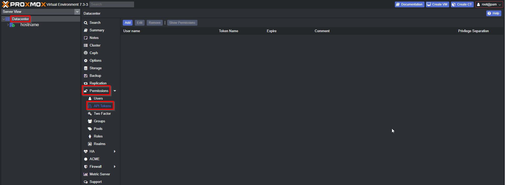
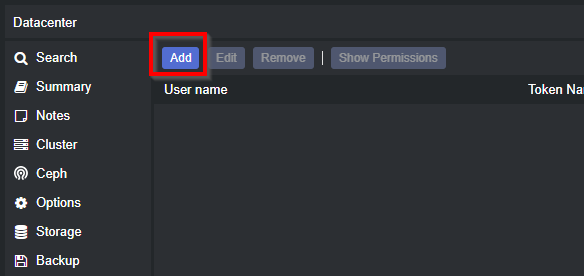
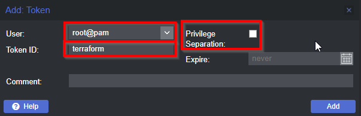
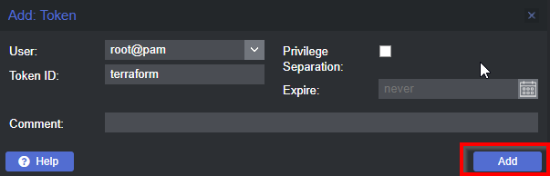

# Packer Proxmox Template

Packer Template for Proxmox based off tutorial from https://www.youtube.com/c/TheDigitalLifeTech

More details on the setup and Packer in general can be found in this video: https://www.youtube.com/watch?v=1nf3WOEFq1Y&t=1257s

### Quick Start Guide

#### Install Packer

Add Hashicorp private repo:

```bash
curl -fsSL https://apt.releases.hashicorp.com/gpg | sudo apt-key add -
sudo apt-add-repository "deb [arch=amd64] https://apt.releases.hashicorp.com $(lsb_release -cs) main"
sudo apt-get update && sudo apt-get install packer
```

#### Credentials

In Proxmox, generate the API key by going to **Datacenter** -> **Permissions** -> **API Tokens**:



Click the **Add** button:



For **User** select `root@pam`

For **Token ID** enter `terraform` (Make sure there is no other API key with this token ID)

Make sure to deselect **Privilege Separation**



Click the **Add** button:



Now copy the **Token ID** field and the **Secret** field to somewhere secure, as these will not regenerate. You may directly copy these values to `credentials.pkr.hcl` as per the below steps.

Open `credentials.pkr.hcl` in this git repo and insert the following details:

- `proxmox_api_url` - This is the url that your Proxmox instance's API is available on, this will usually be format of `https://192.168.10.10:8006/api2/json`

- `proxmox_api_token_id` - This is the token id generated in the Proxmox GUI in the previous steps. **Note:** If you did not store the value from the previous steps, you will need to follow the same procedure again this time recording the **Token ID** from the GUI

- `proxmox_api_token_secret`- This is the secret generated in the Proxmox GUI in the previous steps. **Note:** If you did not store the value from the previous steps, you will need to follow the same procedure again this time recording the **Secret** from the GUI.

The file should look similar to the following:

```hcl
proxmox_api_url = "https://192.168.10.6:8006/api2/json"  # Your Proxmox IP Address
proxmox_api_token_id = "root@pam!myproxkey"  # API Token ID
proxmox_api_token_secret = "api-key-ramdom-letters-numbers-AZxcvsd-4345ba"
```

Save `credentials.pkr.hcl` and then proceed on with the following steps.


#### Configure Packer Template

If your VM Node in Proxmox is not named `pve` then you will need to open `ubuntu-server-jammy.pkr.hcl` and change `source.node` to the actual hostname of your VM Node:

```hcl
source "proxmox" "ubuntu-server-jammy" {
...
      node = "Actual-Hostname"
...
}
```

#### Run Packer

From the root directory of this git repo (`packer/`), first validate your packer files:

```bash
packer validate --var-file='credentials.pkr.hcl' ./ubuntu-server-jammy.pkr.hcl
```

If all is `OK` then proceed to run the packer installation:

```bash
packer build --var-file='credentials.pkr.hcl' ./ubuntu-server-jammy.pkr.hcl
```

Packer should then proceed to build the Ubuntu 22.04 template on your Proxmox Instance
